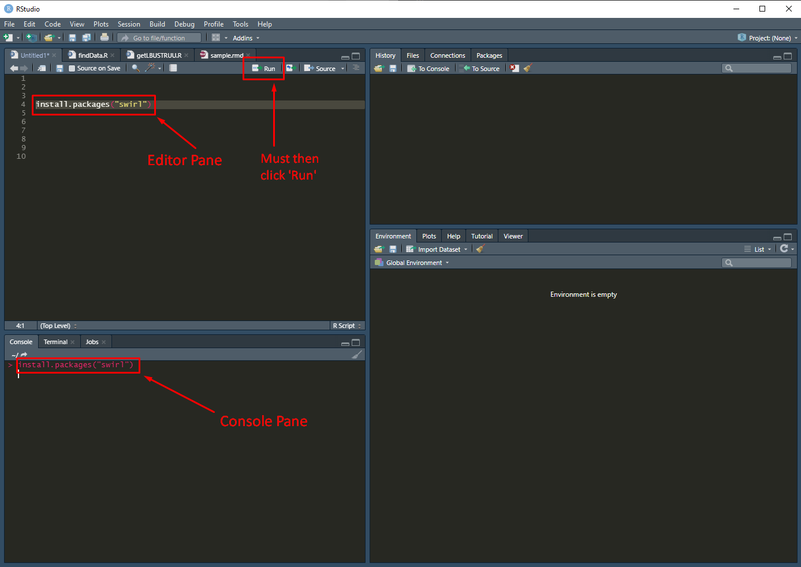
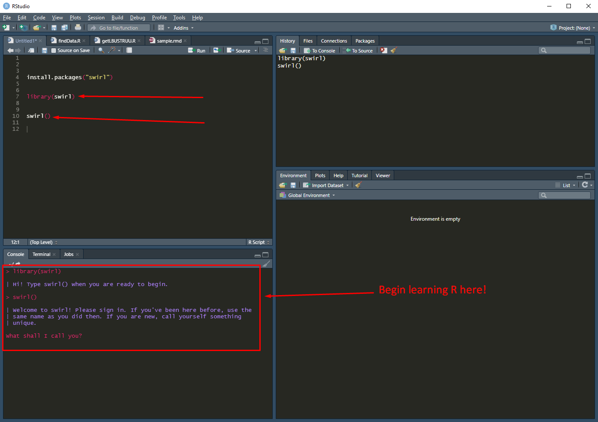

```{r setup, include=FALSE}
knitr::opts_chunk$set(echo = TRUE)
```


### ***IMPORTANT TO NOTE***

This document is meant to provide a handful of resources I personally believe to be useful when beginning to learn R (as well as at a more intermediate level). 


Also, **ALMOST EVERY** resource in this document free of charge with the exception of Codecademy courses - which ***may*** require a
pro account. It is my understanding that there is a free pro trial which should provide ample time to complete the most highly recommended course [as of 10/15/21]. 


### **About R**
 * What is R? 
   * R is an extremely versatile programming language commonly used by statisticians, quantitative analysts, and data scientists. It is widely used in academic research as well. 
 * What is it used for?
   * Statistical analysis 
   * Cleaning and handling large amounts of data
   * Report generation with an emphasis on aesthetics and reproducibility
   * Webapp and interactive dashboard production
 * Why is R a good language to learn? 
   * The tidyverse package allows users to create code that is *extremely readable*, which is great for people first learning to program 
   * Rstudio is an easily accessible **free** Integrated Development Environment (IDE) - this is where you'll likely be writing code 
   * There is a large and active community that provide an enourmous amount of support 
   * RMarkdown documents allow for executable code to be embedded within reporting functions which can combine the processes of gathering, analyzing, and displaying data into an automated and single workflow. This greatly increases the reproducibility and re-usability of your work. 


### **Learn the Command Line**
 
 It’s important to understand the basics of computer architecture - so before you start learning R, I
 ***would encourage*** (but it isn't completely necessary) you to complete this course: [**Learn the Command Line**](https://www.codecademy.com/learn/learn-the-command-line)
 
 The time to completion is estimated at 8 hours, but I imagine that many are capable of finishing it much quicker. Core topics covered are as follows: 

  * Navigating the File System
  * Viewing and Changing the File System
  * Redirecting Input and Output 
  * Configuring the Environment


### **What to Install** 
If you don't already have R downloaded and installed, you should do so [**here**](https://cran.rstudio.com/).

Next you should install RStudio, this is a fantastic IDE (Integrated Development Environment) for beginners. The free version will offer anything the vast majority of users will need, download it [**here**](https://www.rstudio.com/products/rstudio/download/).


### **Entering Your R Environment and Swirl** 

Once you have your IDE and R installed, you can begin learning R with tutorials inside the environment. This is available through a 'package' called 'swirl'. To install a package you can enter the following into the console, or run this code from the editor pane:


```{r install_swirl, echo=T, eval=F}
    install.packages("swirl")
```


\newline


Then load the package with:

```{r lib_swirl, echo=T, eval=F}
    library(swirl)
```

and run the follwing function:

```{r run_swirl, echo=T, eval=F}
    swirl()
```

\newline


After going  through this process you should have access to a variety of tutorials - right there in your R environment! In my opinion this is the ***best*** introduction you can get to the language. Initially, going one by one through the preinstalled courses is recommended, but early on in my R career I know I came back (multiple times) to the courses that covered R unique topics like 'lapply' and sapply'. 

If you have enjoyed the base swirl courses, you can find more and instructions on how to install them [**here**](https://github.com/swirldev/swirl_courses#swirl-courses). 


### **Learning R - No Installation Necessary**
Codecademy offers a ***non-pro*** course for learning R, approximately 2 years ago [from 10/15/21] I completed about 20% of it and it was OK. That course is web browser based and personally, I think swirl is a better option - especially because you are learning within the R environment you are most likely to use. However, this is another or supplemental option that can be completed [**here**](https://www.codecademy.com/learn/learn-r).

The topics covered are as follows:

 * Introduction
 * Data Frames
 * Data Cleaning
 * Fundamentals of Data Visualization with ggplot2 - **Very Important** 
 * Aggregates
 * Joining Tables - **Very Important**
 * Mean, Meadian, and Mode
 * Variance and Standard Deviation
 * Quartiles, Quantiles, and Interquartile Range
 * Hypothesis Testing 


### **My Essential Packages** 

* [**dplyr**](https://dplyr.tidyverse.org/)
  * This package helps you to program with far more readable/intuitive functions and plenty of support
  * The cheatsheet can be found here [**here**](https://github.com/rstudio/cheatsheets/blob/master/data-transformation.pdf) 
  * Included in this package is the "%>%" (aka "pipe operator"), which I use **fervently**. Look to the cheatsheet for examples of how to use it

* [**ggplot2**](https://ggplot2.tidyverse.org/)
  * This package helps you to make aesthetically appealing graphs in an easier to read syntax
  * The following link is my [**#1 graph making resource**](https://www.cedricscherer.com/2019/08/05/a-ggplot2-tutorial-for-beautiful-plotting-in-r/)

* [**readxl**](https://readxl.tidyverse.org/)
  * With this package you can read in a variety of files - most importantly excel files


### **My Essential Websites**
* [**RDocumentation**](https://www.rdocumentation.org)
  * Displays the documentation relevant to a specific function/package
* [**rdrr.io**](https://www.rdrr.io/r/)
  * Also displays the documentation relevant to a specific function/package - really only aesthetic differences between the two
* [**R-bloggers**](https://www.r-bloggers.com)
  * A curated stream of interesting articles and useful tutorials. This is a fantastic place to find new packages or ideas regarding how to use skills you may already have. 


### **R for Data Science**
Nearly anyone who spends a significant amount of time learning or using R will at some point come across the name 'Hadley Wickham'. Hadley is a titan in the R scene and I highly recommend his book [**R for Data Science**](https://r4ds.had.co.nz), and later on... [**Advanced R**](https://adv-r.hadley.nz/index.html). 


### **Various Websites I've Found Useful**
* [**R for Cats**](https://rforcats.net/)
  * "An intro to R for new programmers"
  
* [**Guru99 All Applys**](https://www.guru99.com/r-apply-sapply-tapply.html)
  * Learning about the "apply family" is very important because they are most commonly used instead of loops in R. There are many impassioned discussions regarding whether that is a good thing or if other alternatives are more appropriate (see [**'map()' function family**](https://purrr.tidyverse.org/reference/map.html))... But in any case, applys are used ***a lot*** in R, so you should understand how they work. 
  
* [**aRrgh: a newcomer's (angry) guide to R - and apology**](http://arrgh.tim-smith.us/#fnref:engineers)
  * The thoughts and lessons learned by an angry man
  * I found his article on [**Atmoic Vectors**](http://arrgh.tim-smith.us/atomic.html) particularly useful early on


* [**Your R script is a program!**](https://epibayes.io/post/20160531_your_r_script/)


* [**Official R Website**](https://cran.r-project.org/)

* [**Data Science Reddit Wiki for R**](https://www.reddit.com/r/datascience/wiki/resources#wiki_r_programming)


* [**The Statistical Computing with R subreddit**](https://www.reddit.com/r/rstats/)

